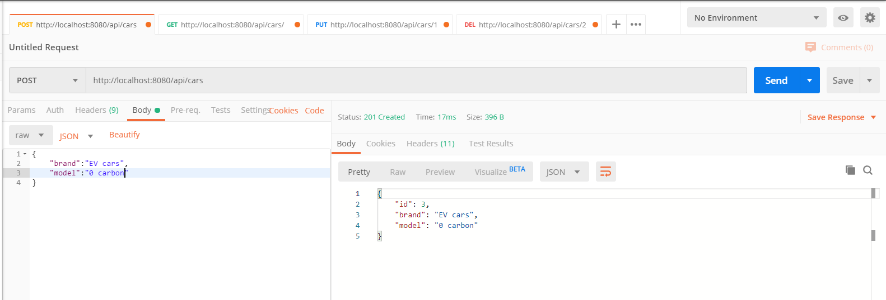
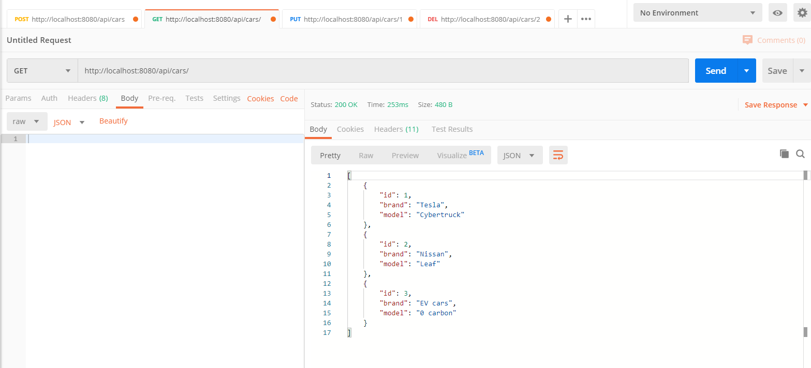
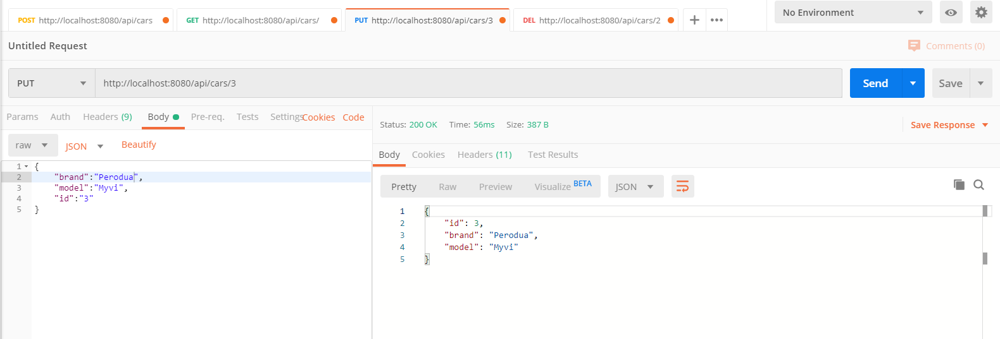
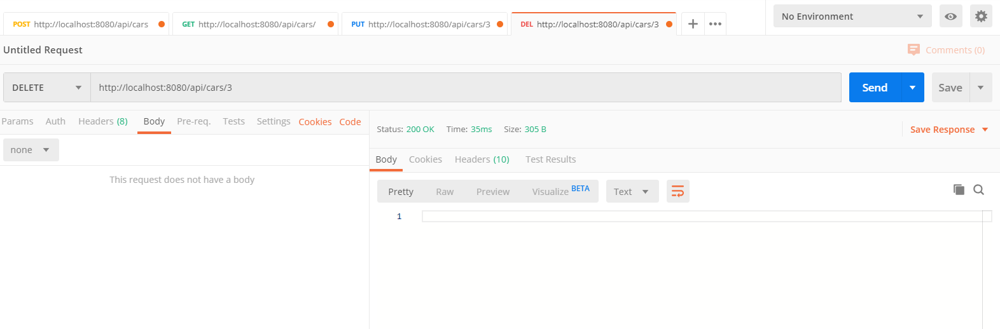

# Screenshots of CRUD

POST method to create 3 different cars.

GET method to retrieve the 3 cars.

PUT method to edit the third car. Not sure why ID field has to be put in the third row.

DELETE method to delete the third car.
