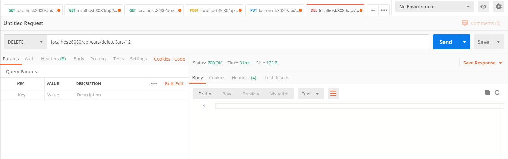

# Mission 3 Relational Database with JDBCTemplate

## GET Method

1. GET Method

    - GET all cars
    

    - GET by id
    Note that this is return in List, it can be returned in Object, but keeping this returning List for the consistency as other methods are returning List.
    

    - GET by brand
    Note that this is return in List, as queryForObject would return error like this [expect: 1, actual: 2].
    

2. POST Method

    

    Verify by calling getAllCars.
    

    Verify from local mySql instance.
    

3. PUT Method
    

    Verify by calling getAllCars.
    

    Verify from local mySql instance.
    

4. DELETE Method
    

    Verify by calling getAllCars.
    

    Verify from local mySql instance.
    
